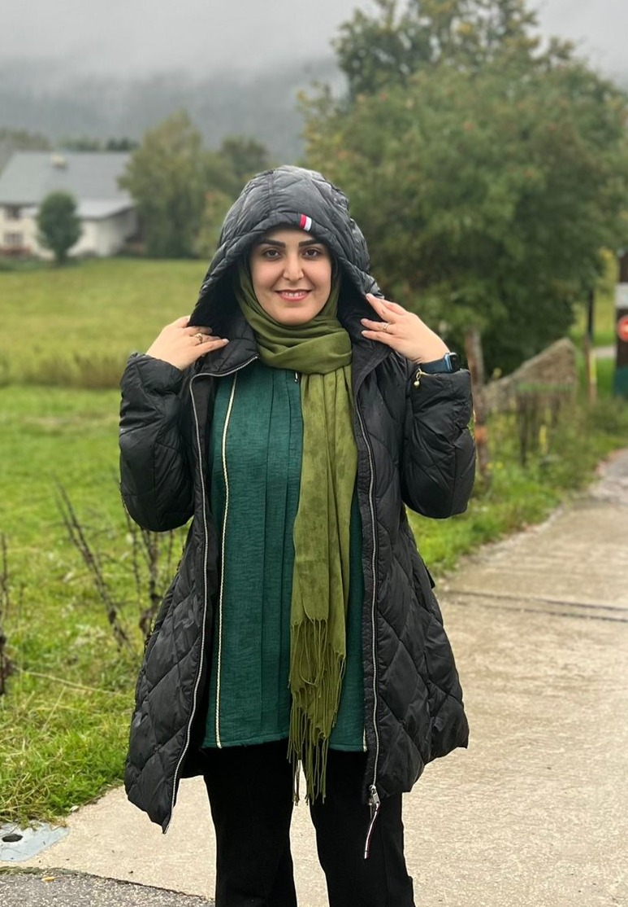

<link rel="stylesheet" href="assets/css/style.css">

**Zahra Kanani**  
Grenoble, France  
📧 [zahrakanani26@gmail.com](mailto:zahrakanani26@gmail.com)  
🔗 [LinkedIn](https://www.linkedin.com/in/zahrakanani)

---

I am a Biomedical Engineer specializing in **Artificial Intelligence for Healthcare**.  
My goal is to develop AI methods for medical imaging and clinical decision support, with a focus on model robustness, fairness, and real-world impact.

### Education
- **MSc in AI for One Health**, Université Grenoble Alpes (2024–2025)  
  Thesis: *Improving Semi-Supervised Learning under Class Imbalance*  
- **MSc & BSc in Biomedical Engineering**, AmirKabir University of Technology, Iran

### Interests
- Medical AI & Image Analysis  
- Domain Adaptation & Fairness in ML  
- Medical Device Regulation & Compliance
