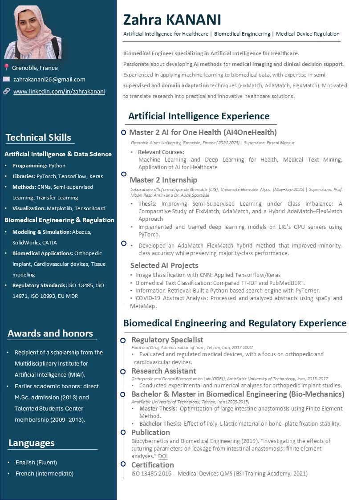

  

    <h1 style="margin:0; color:#004d40;">Curriculum Vitae</h1>
    <a href="CV_zahra.pdf" download 
       style="background:#00796b;color:#fff;padding:8px 14px;border-radius:8px;text-decoration:none;font-weight:600">
      📄 Download Full CV (PDF)
    </a>
  

  <!-- Smaller, centered CV image -->
  

    
  

